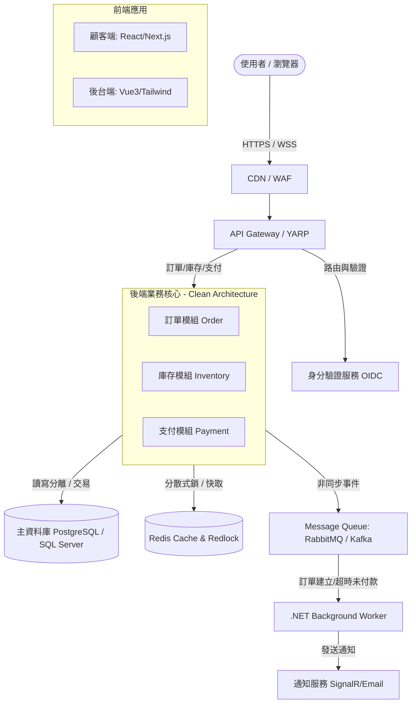

# Designing C# Order System Architecture

**Conversation ID**: `3f228415-d2d6-47a5-98d7-8bfa1abe9c0b`

---

### 👤 User

如果後端底層要用C#開發，預計設計一套訂單系統，你會怎麼設計整個前後端

### 🤖 Assistant

設計一套以 **C# (.NET)** 為後端底層的**訂單系統**，需要考慮高併發（High Concurrency）、資料一致性（Data Consistency）、系統擴展性與容錯能力。

以下為您規劃一套結合現代化架構的 **前後端分離訂單系統設計方案**：

---

# 1. 系統架構藍圖 (System Architecture)

對於訂單系統，我們建議採用 **領域驅動設計 (Domain-Driven Design, DDD)** 的思維。初期可以使用 **模組化單體架構 (Modular Monolith)** 以利快速開發與部署，並在業務成長後無痛拆分為 **微服務架構 (Microservices)**。

---

# 2. 後端設計 (C# / .NET Core)

後端採用 **.NET 8 / 9**，並遵循 **乾淨架構 (Clean Architecture)** 與 **CQRS (命令查詢職責分離)** 模式。

### 核心技術選型
*   **Web 框架**：ASP.NET Core Web API
*   **ORM**：Entity Framework Core (EF Core) 搭配 Dapper（查詢優化）
*   **異步事件驅動**：MassTransit 搭配 RabbitMQ 或 Kafka
*   **快取與鎖**：StackExchange.Redis (用於熱點商品快取、庫
<truncated 4339 bytes>

    *   使用 **SignalR** 與後端建立 WebSocket 連線。
    *   當後端收到第三方支付（如 LINE Pay）的付款成功 Webhook 時，透過 SignalR 即時將狀態推送到前端，網頁自動從「付款中」轉跳至「付款成功」，無需使用者手動重新整理。

#### B. 後台訂單管理看板
*   **大數據量虛擬滾動 (Virtual Scroll)**：後台客服或出貨人員處理成千上萬筆訂單時，列表採用虛擬滾動防止 DOM 節點過多導致瀏覽器卡頓。
*   **圖表可視化**：整合 Chart.js 或 ECharts，提供每日營業額、訂單轉換率、熱門商品排行等視覺化看板。

---

# 5. 安全性與監控 (Security & Observability)

1.  **驗證與授權 (Auth)**：
    *   採用 **OAuth2 / OIDC** 協議。後端可使用 **OpenIddict** 或 **Duende IdentityServer**。
    *   使用 JWT Token 傳遞身分資訊，並劃分 Scope (如 `order.read`, `order.write`)。
2.  **API 安全防護**：
    *   **限流 (Rate Limiting)**：在 API Gateway (如 YARP) 設定頻率限制，防止惡意刷單。
    *   **資料傳輸加密**：全程強制 HTTPS，敏感資料（如收件人個資）在資料庫中加密存儲。
3.  **監控與日誌 (Observability)**：
    *   使用 **Serilog** 結構化日誌，並匯入 **ELK (Elasticsearch, Logstash, Kibana)** 或 **Seq** 便於排查問題。
    *   使用 **OpenTelemetry** 進行鏈路追蹤 (Distributed Tracing)，監控下單流程中哪個環節（如資料庫或第三方 API）產生延遲。

---

### 💡 下一步建議

如果您準備開始動手開發此系統，建議您：
1.  **先從 Modular Monolith 開始**：將 `Order`、`Inventory`、`Payment` 寫在同一個 ASP.NET Core 專案中，但**嚴格劃分資料夾與 Namespace**，資料庫表也彼此獨立。未來需要擴展時，可直接將該目錄拆分為獨立微服務。
2.  **優先設計核心 API 合約 (API First Design)**：先定義好前後端的 OpenAPI (Swagger) 規格，讓前端與後端能同步並行開發。

### 👤 User

為何不使用.net 10

### 🤖 Assistant

這是一個非常好的提問！在目前的時空背景下（2026 年），**.NET 10 確實是開發新系統的首選與最推薦的版本**。

我先前習慣性地提到 .NET 8/9，是因為它們是過去兩年最成熟的主流版本。但事實上，**.NET 10 已於 2025 年 11 月正式發布，且它是長期支援（LTS, Long-Term Support）版本**。

對於一套全新的訂單系統，我們**非常建議直接採用 .NET 10**，原因如下：

### 1. 長期支援 (LTS) 的穩定性
*   .NET 9 是短期支援 (STS) 版本，其生命週期通常只有 18 個月。
*   **.NET 10 作為 LTS 版本，提供長達 3 年的官方支援與安全更新**。對於訂單、金流這種要求高穩定性、不希望頻繁升級基礎框架的企業級系統，LTS 版本是基本要求。

### 2. 針對高併發 (High Concurrency) 的效能優化
訂單系統核心痛點在於高併發下的吞吐量。.NET 10 在執行期 (Runtime) 進行了更深度的優化：
*   **垃圾回收 (GC) 與記憶體優化**：進一步降低了 GC 暫停時間（GC Pause），提升了記憶體密集型操作（如解析大量訂單 JSON）的吞吐量。
*   **AOT (Ahead-Of-Time) 編譯的改進**：.NET 10 對 Native AOT 的支援更加成熟。如果將訂單的微服務使用 Native AOT 編譯，可以達到**極快的啟動速度**與**極低的記憶體佔用**，非常適合運行在 Kubernetes 等容器化環境中進行快速水平擴展。

### 3. C# 14 的語法糖與開發效率
隨 .NET 10 推出的 **C# 14** 引入了更多實用特性，能讓訂單系統的業務邏輯寫法更乾淨：
*   **更強大的 Pattern Matching**：在處理「訂單狀態機（Order State Machine）」流轉時（例如：待付款 -> 已付款 -> 出貨中），程式碼會更直觀且安全。
*   **唯讀集合與效能優化**：在處理訂單明細（Order Items）等不允許被輕易修改的領域模型（Domain Model）時，語法更為簡潔。

### 4. 更好的 ASP.NET Core 10 與 EF Core 10 整合
*   **EF Core 10** 針對複雜的 SQL 查詢生成進行了優化，並提供了更好的批次更新/刪除支援，這對訂單歷史紀錄的封存或批量狀態更新非常有用。
*   **內建的 OpenAPI (Swagger) 支援更完善**，不再依賴第三方套件即可生成高品質的 API 文件。

---

**總結來說**：先前提到 .NET 8/9 是基於過去的過渡期思維。在 2026 年的今天，**直接使用 .NET 10 開發這套訂單系統是完全正確且最佳的決策**。

### 👤 User

前端你會建議用react還是vue

### 🤖 Assistant

選擇 **React** 還是 **Vue**，通常取決於**團隊成員的技術背景**、**專案規模**以及**未來維護的考量**。這兩個框架在 2026 年都非常成熟，且都能完美搭配 .NET 10 後端。

以下為您做深度的對比分析，並給出具體的場景建議：

---

### React vs. Vue 核心對比

| 評估維度 | React (搭配 Next.js / Vite) | Vue 3 (搭配 Nuxt.js / Vite) |
| :--- | :--- | :--- |
| **學習曲線** | **較陡峭**。需要熟悉 JSX、Functional Programming 概念、不變性 (Immutability) 以及 Hook 的依賴陣列。 | **平緩**。單檔案組件 (SFC) 結構（HTML/CSS/JS 分離）非常直觀，Composition API 易學易用。 |
| **生態系規模** | **極大**。全球市場佔有率第一，第三方套件（如 UI 庫、圖表、地圖）極為豐富，遇到問題極易在 Stack Overflow 找到解答。 | **中大**。在亞洲（特別是台灣、中國）非常流行，社群活躍，官方維護的核心套件（如 Router, Pinia）整合度極高。 |
| **開發效率** | 中等。由於給予開發者極大的自由度，團隊需要花時間制定規範（程式碼風格、資料流管理）。 | **極高**。開箱即用（Out-of-the-box）的特性多，語法簡潔，寫起程式碼來速度非常快。 |
| **狀態管理** | 多元且靈活（Zustand, Redux Toolkit, Recoil, TanStack Query）。 | 統一且直觀（Pinia, TanStack Query）。 |
| **適合專案** | 大型、複雜、需要高度自定義、有長期維護與跨國擴展需求的系統。 | 中大型專案、需要快速交付的原型（MVP）、管理後台系統。 |

---

### 針對「訂單系統」的具體建議

訂單系統通常可以拆分為兩個截然不同的前端應用，您可以根據這兩個應用的特性來選擇：

#### 1. 顧客端 (Client Portal) — 建議選 **React (Next.js)**
*   **原因**：
    *   **效能與 SEO**：Next.js 的 SSR (伺服器渲染) 和 ISR (增量靜態生成) 技術非常成熟，對於商品展示頁的 SEO 以及結帳頁面的載入速度至關重要。
    *   **金融/支付對接**：許多國外的金流 SDK（如 Stripe、PayPal）或前端分析工具，其 React 的官方支援與範例通常是最齊全、更新最快的。
    *   **大型架構控制**：React 的單向資料流與嚴格的重渲染機制，在處理複雜的購物車狀態與優惠券疊加計算時，較不易出現意料之外的 Side Effects（副作用）。

#### 2. 商家管理後台 (Admin Dashboard) — 建議選 **Vue 3 (Vite + Element Plus)**
*   **原因**：
    *   **開發速度決定一切**：後台管理系統通常包含大量的「表單（Form）」與「表格（Table）」（如訂單篩選、出貨單批次匯入、庫存調整）。
    *   Vue 搭配像 **Element Plus** 或 **Ant Design Vue** 這樣的 UI 框架，提供了極其強大的後台組件（如內建篩選的表格、多功能分頁、日期區間選擇器），通常幾行程式碼就能搞定一個複雜的報表頁面。
    *   開源社群有非常多現成的 **Vue Admin Templates**（例如 Geeker-Admin, Soybean Admin），直接拿來修改可以省去 80% 的後台基礎建設時間。

---

### 💡 結論：您該怎麼選？

1.  **如果您的團隊只有 1-2 位前端，且需要同時開發顧客端與後台：**
    *   👉 **強烈建議全線採用 Vue 3**。因為 Vue 學習快、寫得快，能讓您的訂單系統以最快的速度上線。
2.  **如果您預期這是一個百萬級用戶、未來會有二三十人前端團隊共同維護的大型專案：**
    *   👉 **建議採用 React**。React 的嚴格規範與 TypeScript 的深度整合，在大型團隊協作時更能保證程式碼的品質與可維護性。
3.  **折衷方案（業界常見做法）：**
    *   **顧客端** 用 **React (Next.js)** 追求極致效能與 UX。
    *   **後台管理** 用 **Vue 3** 追求極致的開發效率。